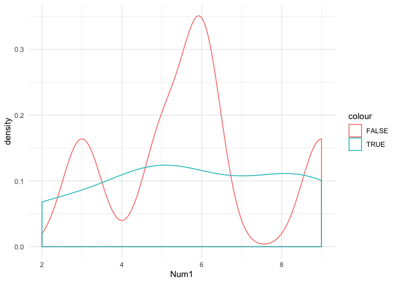
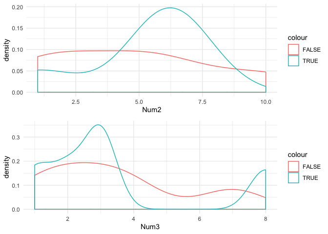

<!-- README.md is generated from README.Rmd. Please edit that file -->

# expldata

<!-- badges: start -->

[](https://travis-ci.com/ckornafel/expldata)
[](https://ci.appveyor.com/project/ckornafel/expldata)
[](https://codecov.io/gh/ckornafel/expldata?branch=master)
=======

<!-- badges: end -->

This package provides easy to use functions that can be used to perform
initial exploratory data analysis. Instead of using multiple functions
from multiple packages, this package allows a single command to perform
and display beneficial data information, allowing the user to plan any
necessary transformations and corrections prior to selecting the most
appropriate model and or technique. .

## Installation

You can install the released version of expldata from
[CRAN](https://CRAN.R-project.org) with:

``` r
install.packages("expldata")
```

And the development version from [GitHub](https://github.com/) with:

``` r
# install.packages("devtools")
devtools::install_github("ckornafel/MSDS696-EDAPackage")
```

## EDA / multiplot

The EDA function is the multi-purpose tool of this package which is the
main function of the package. EDA will perform every test contained in
the package and display the results to the screen in an easy to read
table. Additionally, if the plots parameter is set to TRUE, the function
will return a list of ggplot2 density plots. An additional feature is
that the function will determine if there is a single factor variable
and assume that it is the dependent variable. This assumption will
adjust the density plots to group and color code each of the factor
levels for each plot. The plots can be displayed using the multiplot
function also included in the package.

``` r
library(expldata)
#> Warning: replacing previous import 'ggplot2::theme_grey' by
#> 'huxtable::theme_grey' when loading 'expldata'
library(huxtable)
```

**Create Example DataFrame**

``` r
set.seed(100)
example_df <- data.frame(replicate(5,sample(0:10, 10, replace = TRUE)))
example_df$X10 <- as.factor(c(TRUE, FALSE, FALSE, TRUE, TRUE, FALSE, FALSE, TRUE, TRUE, FALSE))
example_df$X11 <- c("a","b","c","d","a","b","c","d","a","b")
colnames(example_df)<- c("Num1","Num2","Num3","Num4","Num5","Fact1","Char1")
str(example_df)
#> 'data.frame':    10 obs. of  7 variables:
#>  $ Num1 : int  9 6 5 2 8 9 6 5 5 3
#>  $ Num2 : int  6 5 1 6 6 6 10 7 1 2
#>  $ Num3 : int  2 7 1 8 1 2 3 3 3 4
#>  $ Num4 : int  10 6 8 10 3 1 5 6 0 10
#>  $ Num5 : int  5 8 8 8 5 7 10 6 0 8
#>  $ Fact1: Factor w/ 2 levels "FALSE","TRUE": 2 1 1 2 2 1 1 2 2 1
#>  $ Char1: chr  "a" "b" "c" "d" ...
```

``` r
examplePlots <- EDA(example_df, plots = TRUE)
#> Name of Object: example_df 
#> Class of Object: data.frame 
#> 
#> Data Loading Information               
#>   rows   row_match   cols   col_match  
#> ───────────────────────────────────────
#>     10                  7              
#> 
#> 
#>  
#> Sample                                              
#>   Num1   Num2   Num3   Num4   Num5   Fact1   Char1  
#> ────────────────────────────────────────────────────
#>      9      6      2      1      7   FALSE   b      
#>      2      6      8     10      8   TRUE    d      
#>      3      2      4     10      8   FALSE   b      
#>      5      1      1      8      8   FALSE   c      
#>      8      6      1      3      5   TRUE    a      
#> 
#> Rows with Missing Values             
#>     Row   NA_Count   Percent_of_Row  
#> ─────────────────────────────────────
#>       0          0   0.00%           
#> 
#> Rows with Duplicate Values                          
#>   Duplicate_Rows   Percent_Duplicate   Unique_Rows  
#> ────────────────────────────────────────────────────
#>                0                   0            10  
#> 
#> 
#> Column Details                                                              
#>   Column   Col_Type   NA_Count   NA_Perce   Unique_V   Duplicat   Min_Valu  
#>                   s                    nt      alues   ed_Value          e  
#>                                                               s             
#> ────────────────────────────────────────────────────────────────────────────
#>    Char1   characte          0     0.00 %          4          6             
#>                   r                                                         
#>    Fact1     factor          0     0.00 %          2          8             
#>     Num1    integer          0     0.00 %          6          4          2  
#>     Num2    integer          0     0.00 %          6          4          1  
#>     Num3    integer          0     0.00 %          6          4          1  
#>     Num4    integer          0     0.00 %          7          3          0  
#>     Num5    integer          0     0.00 %          6          4          0  
#> 
#> 
#>   Column   Min_Valu   Max_Valu   Spread   SW_PVal   Normal_D   Inner_Ou  
#>                   e          e                           ist     tliers  
#> ─────────────────────────────────────────────────────────────────────────
#>    Char1                                                                 
#>    Fact1                                                                 
#>     Num1          2          9        7     0.459       TRUE          0  
#>     Num2          1         10        9     0.172       TRUE          0  
#>     Num3          1          8        7    0.0565       TRUE          2  
#>     Num4          0         10       10     0.271       TRUE          0  
#>     Num5          0         10       10    0.0665       TRUE          1  
#> 7/8 columns shown.
```

## Multiplot

The multiplot function is one that was adapted from Winston Chang in his
R Graphics Cookbook
(<http://www.cookbook-r.com/Graphs/Multiple_graphs_on_one_page_(ggplot2)/>).
This function will print several plots stored in a list and display them
to the viewer. The multiplot function can also accept addition grid
parameters if the user would like to customize the displayed output.


